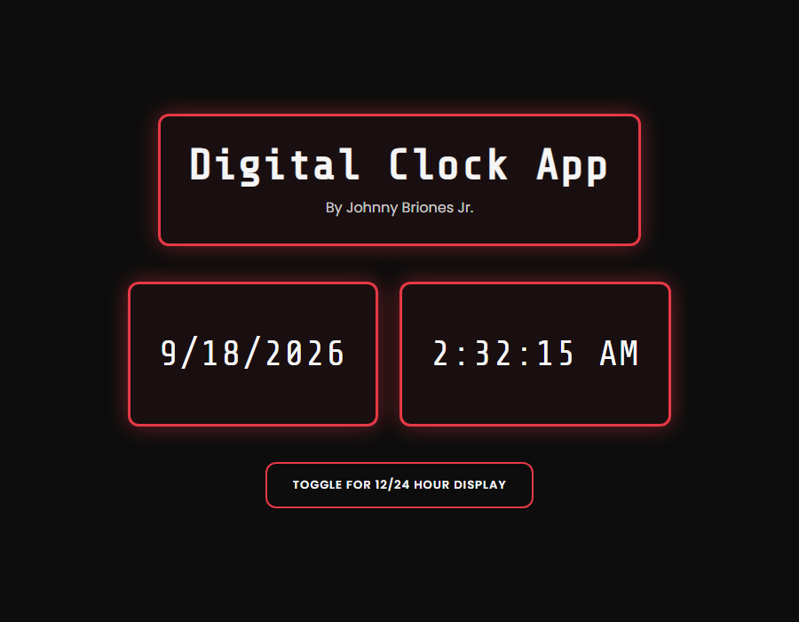

# Digital Clock App

Digital Clock Application created using HTML, CSS and JavaScript

Check the time [here](https://jbri91.github.io/digital_clock_app-master/)
*(live demo is deployed from `master`, so it currently shows the original 2020 design — see the "after" screenshot below for what's on this branch)*

## Before / After

| Original (2020) | With Claude Code (`ai-assisted` branch) |
|---|---|
|  |  |

## Running it locally

No build step, no dependencies — just static HTML/CSS/JS.

- Simplest: double-click [index.html](index.html) to open it directly in a browser.
- Nicer for editing: install the "Live Server" VS Code extension, right-click [index.html](index.html) → "Open with Live Server" to get auto-reload on save.

## About this branch (`ai-assisted`)

This branch is where the project is being revived with [Claude Code](https://claude.com/claude-code)'s help — `master` stays untouched as the original 2020 version. Changes made so far:

- **Fixed several longstanding bugs**: incorrect AM/PM at noon, incorrect midnight display in 24-hour mode, a date display that froze at page load, redundant timers stacking on every toggle click, and an accidental global variable. Full details in [CODE_WALKTHROUGH.md](CODE_WALKTHROUGH.md).
- **Added tests**: [test-manual.html](test-manual.html) runs the time-formatting logic against the specific edge cases that were previously broken (noon, midnight, both display modes) and shows PASS/FAIL on screen.
- **Refreshed the visual design**: real typography (`Share Tech Mono` + `Poppins` via Google Fonts), consistent spacing and colors via CSS custom properties, rounded corners with a soft glow, and a properly functioning toggle button (it previously referenced Bootstrap classes that did nothing, since Bootstrap was never loaded).
- **Documented how the app works**: see [CODE_WALKTHROUGH.md](CODE_WALKTHROUGH.md) for a full file-by-file explanation of how the HTML, CSS, and JS connect.

# Summary

This is the first project that I put together since joining the Software Development Mastermind Mentorship. I did not know much about coding coming in but I was able to use the resources given to me to learn the fundamentals to be able to put this together. It took me some time to go through the material and understand what is going on behind this application. With the help of the team of mentors I have, I managed to problem solve my way through it. 

It was challenging for me to understand how to toggle the button to be able to show military time as well as standard time. It was a fun problem to solve and I look forward to more of it! 

# Author
* Johnny Redry Briones Jr. - *Programmer*
